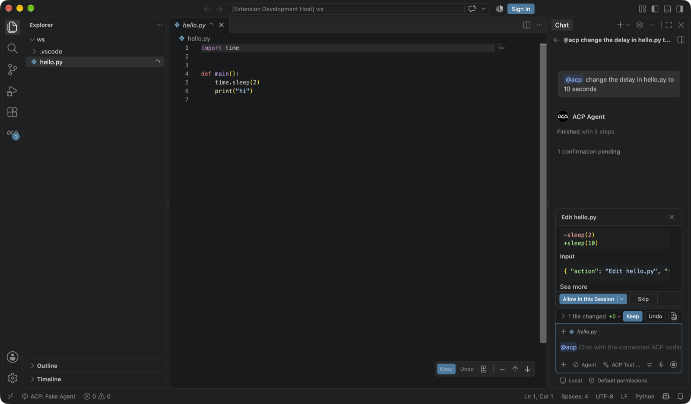
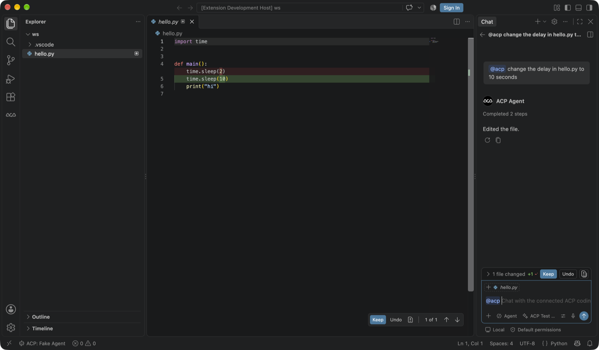

# ACP Agents for VS Code

Chat with any [Agent Client Protocol (ACP)](https://agentclientprotocol.com/) coding agent — Claude Code, Codex, Antigravity, Qwen Code and more — **inside VS Code's native Chat view**, with the same edit-review experience as GitHub Copilot: native tool confirmations, a "files changed" bar, inline diffs and Keep / Undo.

Each agent runs as its own official CLI, so you use your existing subscription / OAuth login for that vendor. The extension never handles vendor tokens itself.

> This is a fork of [formulahendry/vscode-acp](https://github.com/formulahendry/vscode-acp) (MIT). It adds a chat participant built on VS Code's proposed chat APIs, so it is installed from a `.vsix`, not from the Marketplace. See [Installation](#installation).

## Screenshots

**The agent asks before editing.** The confirmation is VS Code's own Allow / Skip UI, with a preview of the change. It disappears once you answer.



**Edits are reviewed like Copilot's.** You get the "1 file changed" bar with Keep / Undo, an inline diff in the editor, and per-change navigation.



<sub>Screenshots come from the automated UI test (`npm run test:ui`), which uses a fake agent and a placeholder model, so the model picker reads "ACP Test".</sub>

## Features

- **`@acp` chat participant** in the native Chat view. It drives whichever agent is connected.
  - Streams agent messages, thinking, tool calls and plans as native chat parts.
  - Cancel works the same as in Copilot.
- **Copilot-style edit review.**
  - Agent edits become pending chat edits, whether the agent writes files through the client (`fs/write_text_file`) or on its own.
  - Review them in the "files changed" bar and inline diffs, then Keep or Undo, per file or per hunk.
- **Native permission prompts.** ACP `session/request_permission` is shown as a VS Code tool confirmation (Allow / Allow in this Session / Skip) with a diff preview.
- **Fallback where native edits are blocked.**
  - Agent-host chat sessions (e.g. Copilot CLI) reject extension edits.
  - There the extension snapshots files before the agent edits them, then shows a diff card with Keep / Undo / Open diff.
  - Pending changes persist across restarts in the **Pending Changes** view.
- **Everything from the upstream ACP Client:**
  - Multi-agent configuration with per-agent session lists.
  - The sidebar chat webview.
  - Session config options (mode / model pickers).
  - Terminal execution.
  - Protocol traffic logging.
  - The agent registry.

## Requirements

- **VS Code 1.140.x.** The extension uses proposed APIs (`chatParticipantAdditions`, `chatParticipantPrivate`) whose shape can change between releases.
- **Node.js 18+**, available from a login shell (`/bin/zsh -l -c 'node -v'`). Agents are launched through your login shell.
- **The CLI for each agent you want to use**, already logged in. For example:
  - Claude Code: `curl -fsSL https://claude.ai/install.sh | bash`, then run `claude` and `/login`.
  - Codex: installed and logged in with `codex`.
  - Antigravity: `agy` on your `PATH`.

## Installation

The proposed APIs mean this extension cannot be published to the Marketplace. The installer handles everything in one step on macOS, Linux or Windows. It needs Node.js 18+ and VS Code's `code` command.

```bash
git clone <this repo> && cd vscode-acp
npm run setup
```

`npm run setup` does four things:
1. Builds `acp-agents-<version>.vsix`.
2. Uninstalls the original **ACP Client** (`formulahendry.acp-client`) if present, because both register the same commands.
3. Installs the `.vsix` with `code --install-extension`.
4. Adds `"enable-proposed-api": ["aminballoon.acp-agents"]` to `~/.vscode/argv.json`, keeping comments and other settings. A backup is saved as `argv.json.bak`.

Then **quit VS Code completely** (`Cmd+Q` / File → Exit) and open it again. `argv.json` is only read at startup.

| Option | Use |
|--------|-----|
| `npm run setup -- --vsix path/to/acp-agents.vsix` | Install a prebuilt `.vsix`, for example from GitHub Releases, without building |
| `npm run setup -- --insiders` | Target VS Code Insiders (`code-insiders`, `~/.vscode-insiders/argv.json`) |
| `npm run setup -- --uninstall` | Remove the extension and its `argv.json` entry |

To update later, run `git pull && npm run setup`, then **Developer: Reload Window**.

Recommended: set `"update.mode": "manual"` in VS Code settings, so an automatic update cannot break the proposed APIs. The extension is tested against VS Code 1.140.

<details>
<summary>Manual installation (without the script)</summary>

```bash
npm install
npx vsce package --no-dependencies
code --install-extension acp-agents-*.vsix
```

Then run **Preferences: Configure Runtime Arguments**, add the following to `argv.json`, and restart VS Code:

```jsonc
"enable-proposed-api": ["aminballoon.acp-agents"]
```

</details>

## Usage

1. Open the **ACP** view in the Activity Bar and click **Connect** on an agent.
2. Open the Chat view (`Ctrl+Cmd+I` / `Ctrl+Alt+I`) and start a new chat. Use a **Local** session, not "Copilot CLI".
3. Type `@acp` followed by your request. Follow-up messages in the same chat stay with `@acp`.
4. When the agent wants to edit a file or run a command, approve it with **Allow** or decline with **Skip**.
5. Review the changes in the "files changed" bar or the editor, then **Keep** or **Undo**.

Tips:
- **Per-chat sessions:** `@acp` uses the agent's active ACP session. Use **ACP: New Conversation** to start a fresh agent session.
- **Copilot CLI sessions:** these sessions block extension edits. There you get the fallback diff card, and changes stay in the **Pending Changes** view until you Keep or Undo them.
- **Debugging:** **ACP: Show Log** and **ACP: Show Protocol Traffic** show what the agent sends. They are useful for checking how a given adapter reports edits.

## Pre-configured Agents

| Agent | Command |
|-------|---------|
| GitHub Copilot | `npx @github/copilot-language-server@latest --acp` |
| Claude Code | `npx @agentclientprotocol/claude-agent-acp@latest` |
| Codex CLI | `npx @agentclientprotocol/codex-acp@latest` |
| Antigravity | `npx -y google-antigravity-acp` |
| Gemini CLI | `npx @google/gemini-cli@latest --experimental-acp` |
| Qwen Code | `npx @qwen-code/qwen-code@latest --acp --experimental-skills` |
| Auggie CLI | `npx @augmentcode/auggie@latest --acp` |
| Qoder CLI | `npx @qoder-ai/qodercli@latest --acp` |
| OpenCode | `npx opencode-ai@latest acp` |
| OpenClaw | `npx openclaw acp` |
| [Kiro CLI](https://kiro.dev/docs/cli/acp/) | `kiro-cli acp` |
| [Hermes Agent](https://hermes-agent.nousresearch.com/docs/user-guide/features/acp) | `hermes acp` |

Add your own with **ACP: Add Agent Configuration** or the `acp.agents` setting.

## Settings

| Setting | Default | Description |
|---------|---------|-------------|
| `acp.agents` | *(see above)* | Agent configurations. Each key is the agent name; the value has `command`, `args` and `env`. |
| `acp.chat.nativeEdits` | `true` | Route agent edits into VS Code's native chat edit UI. Agent-host sessions fall back automatically. |
| `acp.autoApprovePermissions` | `ask` | `ask` shows a confirmation; `allowAll` approves every request. |
| `acp.defaultWorkingDirectory` | `""` | Working directory for agent sessions. Empty uses the current workspace. |
| `acp.logTraffic` | `true` | Log all ACP traffic to the **ACP Traffic** output channel. |

## Commands

| Command | Description |
|---------|-------------|
| `ACP: Connect to Agent` / `Disconnect Agent` / `Restart Agent` | Manage the agent process |
| `ACP: New Conversation` | Start a new session with the connected agent |
| `ACP: Keep All Changes` / `Undo All Changes` | Resolve everything in the Pending Changes view |
| `ACP: Add Agent Configuration` / `Remove Agent` | Edit `acp.agents` |
| `ACP: Show Log` / `Show Protocol Traffic` | Output channels for debugging |
| `ACP: Browse Agent Registry` | Discover ACP agents |

## How It Works

```
VS Code Chat view ──@acp──▶ AcpChatParticipant ──session/prompt──▶ agent CLI (ACP over stdio)
        ▲                         │  ▲                                   │
        │ native parts            │  └── session/update (text, tools) ───┤
        │ (tool calls, edits,     ▼                                      │
        │  confirmations)     TurnRouter ◀── fs/write_text_file, ────────┘
        └──────────────────── PermissionTool    request_permission
```

The main pieces:
- **`src/chat/AcpChatParticipant.ts`:** maps ACP session updates to chat parts.
  - For agents that edit files themselves, it wraps the edit tool call in `externalEdit`, so VS Code tracks the disk change natively.
- **`src/chat/TurnRouter.ts`:** connects client-side ACP requests to the chat turn that is streaming. It handles file writes (`textEdit`) and permission prompts.
- **`src/chat/PermissionTool.ts`:** an internal language-model tool, invoked only to show VS Code's native confirmation UI.
- **`src/chat/proposed.ts`:** the only file that calls proposed APIs, with feature detection. If a VS Code update changes these APIs, this is the file to fix.
- **`src/changes/`:** the session-type-independent fallback. It snapshots files, tracks pending changes, and provides the Pending Changes view.

## Development

```bash
npm install
npm run watch       # or: npm run compile
```

Press `F5` to start the Extension Development Host. `.vscode/launch.json` already passes `--enable-proposed-api`.

Tests:

| Command | What it runs |
|---------|--------------|
| `npm test` | Unit smoke test |
| `npm run test:e2e` | Calls the `@acp` handler directly against a fake ACP agent (`test-fixtures/fake-agent.mjs`). Covers approve, reject, keep and undo. |
| `npm run test:ui` | macOS only. Drives the real Chat view in the installed VS Code and saves screenshots of the test window to `.vscode-test/screenshots/`. Needs Screen Recording permission for your terminal. |

The fake agent copies the message order Claude Code uses for edits:
1. A `tool_call` with empty locations.
2. Locations in a later update.
3. `request_permission`.
4. The agent writes the file itself.
5. `completed`.

`test-fixtures/fake-lm` registers a placeholder language model, because the Chat view refuses requests in a profile with no model.

## Known Limitations

- Proposed APIs: install from `.vsix` only, and VS Code updates may need code changes in `src/chat/proposed.ts`.
- The native confirmation shows an "Input" section, a short JSON summary of the action. VS Code does not offer a way to hide it for extension tools.
- Native Keep / Undo works only in **Local** chat sessions. Agent-host sessions (Copilot CLI and similar) get the fallback diff card.
- "Allow in this Session" is remembered by VS Code, not passed to the agent as `allow_always`.

## Credits & License

Based on [ACP Client](https://github.com/formulahendry/vscode-acp) by Jun Han. MIT — see [LICENSE](LICENSE).
