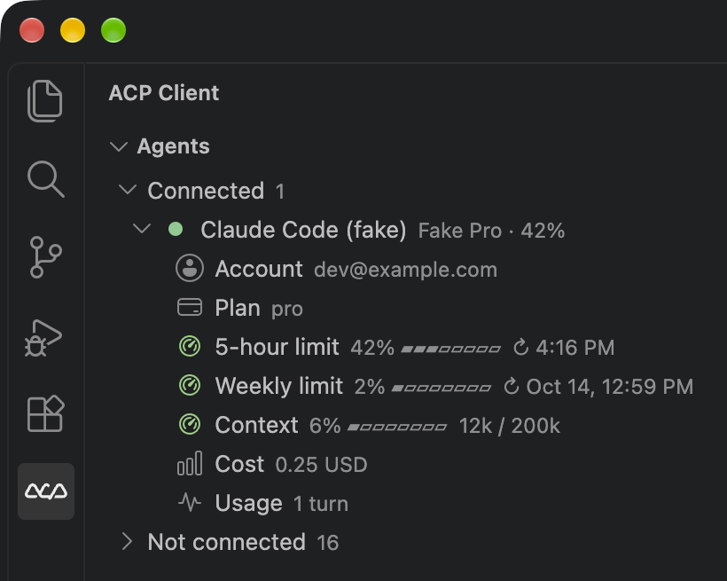

# ACP Chat for VS Code

Chat with any [Agent Client Protocol (ACP)](https://agentclientprotocol.com/) coding agent — Claude Code, Codex, Antigravity, Qwen Code and more — **inside VS Code's native Chat view**, with the same edit-review experience as GitHub Copilot: native tool confirmations, a "files changed" bar, inline diffs and Keep / Undo.

Each agent runs as its own official CLI, so you use your existing subscription / OAuth login for that vendor. The extension never handles vendor tokens itself.

> **Forked from [formulahendry/vscode-acp](https://github.com/formulahendry/vscode-acp)** (ACP Client by Jun Han, MIT) and maintained by [aminballoon](https://github.com/aminballoon). It adds native VS Code Chat integration built on proposed chat APIs, so it is installed from a `.vsix`, not from the Marketplace. See [Installation](#installation) and [Credits & License](#credits--license).

## Screenshots

**The agent asks before editing.** The confirmation is VS Code's own Allow / Skip UI, with a preview of the change. It disappears once you answer.


**Edits are reviewed like Copilot's.** You get the "1 file changed" bar with Keep / Undo, an inline diff in the editor, and per-change navigation.


**Usage limits at a glance.** The Agents view shows each connected agent's account and plan, its five-hour and weekly limits with reset times, its context window, cost, and turns.



<sub>Screenshots come from the automated UI test (`npm run test:ui`), which uses a fake agent and a placeholder model, so the model picker reads "ACP Test" and the account is `dev@example.com`.</sub>

## Features

- **"ACP" chat sessions** in the native Chat view: no `@acp` needed.
  - Pickers under the input choose the agent, its model, effort and mode (or Ask / Auto-approve).
  - Each chat keeps its own picks; several agents can run side by side.
  - The agent's common slash commands (`/compact`, `/init`, `/review`, ...) are offered when the selected agent has them. Any other command can be typed and is sent as is.
  - Sessions the agent already has (from `session/list`, or created in this workspace) show up in the chat sessions list; opening one loads its history.
  - Attach files, problems and symbols as context with `#`.
- **`@acp` chat participant** in any chat (e.g. Local). It drives the agent's active session.
  - Streams agent messages, thinking, tool calls and plans as native chat parts.
  - Cancel works the same as in Copilot.
- **Copilot-style edit review.**
  - Agent edits become pending chat edits, whether the agent writes files through the client (`fs/write_text_file`) or on its own.
  - Review them in the "files changed" bar and inline diffs, then Keep or Undo, per file or per hunk.
  - Edits made outside edit tools (shell commands like `sed -i`, the agent's own patch tooling) are found by comparing the workspace before and after the turn, and shown the same way. This uses a private snapshot repository in the extension's storage; your own git repository is never touched, and it works without one.
- **Native permission prompts.** ACP `session/request_permission` is shown as a VS Code tool confirmation (Allow / Allow in this Session / Skip) with a diff preview.
- **Fallback where native edits are blocked.**
  - Agent-host chat sessions (e.g. Copilot CLI) reject extension edits.
  - There the extension snapshots files before the agent edits them, then shows a diff card with Keep / Undo / Open diff.
  - Pending changes persist across restarts in the **Pending Changes** view.
- **Chats keep their state.**
  - Each chat in the ACP chat sessions list is saved and keeps its own agent, model, mode and permission choices.
  - Reopening a chat after a restart shows its transcript and reattaches the agent's own session (`session/resume`, else `session/load`), so context is kept.
  - Several agents can stay connected at once, one per chat.
  - Agents idle for `acp.chat.idleDisconnectMinutes` are disconnected to free memory, but only if they can restore sessions. The next message reconnects with the chat unchanged.
- **Agents view** in the Activity Bar, grouped into **Connected** and **Not connected**.
  - Connect / disconnect / restart inline or from the context menu. A click opens an ACP chat with that agent.
  - A connected agent's row shows its account and its highest usage limit (e.g. `you@example.com · 42%`). Hover it for a card with every limit as a colored bar.
  - Expand it to see what the agent reports: account, plan, usage limits with a bar and reset time, context window, cost, tokens and turns, and agent version.
  - Usage limits:
    - Claude Code: five-hour / weekly limits from its `/usage` command, answered locally without a model call in a hidden side session, plus the SDK's rate limit events.
    - Codex: the limits it records in `~/.codex/sessions`.
    - Right-click an agent → **Refresh Usage** to update them.
- **Status bar item** showing the connected agent (`ACP: <agent>`); click it to connect an agent.
- **From the upstream ACP Client:**
  - Multi-agent configuration.
  - Terminal execution.
  - Protocol traffic logging.
  - The agent registry.

## Requirements

- **VS Code 1.140.x.** The extension uses proposed APIs (`chatParticipantAdditions`, `chatParticipantPrivate`) whose shape can change between releases.
- **Node.js 18+**, available from a login shell (`/bin/zsh -l -c 'node -v'`). Agents are launched through your login shell.
- **The CLI for each agent you want to use**, already logged in. For example:
  - Claude Code: `curl -fsSL https://claude.ai/install.sh | bash`, then run `claude` and `/login`.
  - Codex: installed and logged in with `codex`.
  - Antigravity: `agy` on your `PATH`.

## Installation

The proposed APIs mean this extension cannot be published to the Marketplace. The installer handles everything in one step on macOS, Linux or Windows. It needs Node.js 18+ and VS Code's `code` command.

```bash
git clone <this repo> && cd vscode-acp
npm run setup
```

`npm run setup` does four things:
1. Builds `acp-chat-<version>.vsix`.
2. Uninstalls the original **ACP Client** extension if present, because both register the same commands.
3. Installs the `.vsix` with `code --install-extension`.
4. Adds `"enable-proposed-api": ["aminballoon.acp-chat"]` to `~/.vscode/argv.json`, keeping comments and other settings. A backup is saved as `argv.json.bak`.

Then **quit VS Code completely** (`Cmd+Q` / File → Exit) and open it again. `argv.json` is only read at startup.

| Option | Use |
|--------|-----|
| `npm run setup -- --vsix path/to/acp-chat.vsix` | Install a prebuilt `.vsix`, for example from GitHub Releases, without building |
| `npm run setup -- --insiders` | Target VS Code Insiders (`code-insiders`, `~/.vscode-insiders/argv.json`) |
| `npm run setup -- --uninstall` | Remove the extension and its `argv.json` entry |

To update later, run `git pull && npm run setup`, then **Developer: Reload Window**.

Recommended: set `"update.mode": "manual"` in VS Code settings, so an automatic update cannot break the proposed APIs. The extension is tested against VS Code 1.140.

<details>
<summary>Manual installation (without the script)</summary>

```bash
npm install
npx vsce package --no-dependencies
code --install-extension acp-chat-*.vsix
```

Then run **Preferences: Configure Runtime Arguments**, add the following to `argv.json`, and restart VS Code:

```jsonc
"enable-proposed-api": ["aminballoon.acp-chat"]
```

</details>

## Usage

1. Click an agent in the **ACP** view (or run **Open ACP Chat**, `Cmd+Shift+A` / `Ctrl+Shift+A`). A new **ACP** chat opens in the Chat view with that agent picked.
   - Or pick **ACP** from the session type menu when starting a new chat.
2. Choose the model, effort and mode under the input, then type your request. The agent connects on first use.
3. When the agent wants to edit a file or run a command, approve it with **Allow** or decline with **Skip**.
4. Review the changes in the "files changed" bar or the editor, then **Keep** or **Undo**.

Tips:
- **`@acp` elsewhere:** in a Local chat, `@acp` uses the agent's active ACP session.
- **Copilot CLI sessions:** these sessions block extension edits. There you get the fallback diff card, and changes stay in the **Pending Changes** view until you Keep or Undo them.
- **Debugging:** **ACP: Show Log** and **ACP: Show Protocol Traffic** show what the agent sends. They are useful for checking how a given adapter reports edits.

## Pre-configured Agents

| Agent | Command |
|-------|---------|
| GitHub Copilot | `npx @github/copilot-language-server@latest --acp` |
| Claude Code | `npx @agentclientprotocol/claude-agent-acp@latest` |
| Codex CLI | `npx @agentclientprotocol/codex-acp@latest` |
| Antigravity | `npx -y google-antigravity-acp` |
| Gemini CLI | `npx @google/gemini-cli@latest --experimental-acp` |
| Qwen Code | `npx @qwen-code/qwen-code@latest --acp --experimental-skills` |
| Auggie CLI | `npx @augmentcode/auggie@latest --acp` |
| Qoder CLI | `npx @qoder-ai/qodercli@latest --acp` |
| OpenCode | `npx opencode-ai@latest acp` |
| OpenClaw | `npx openclaw acp` |
| [Kiro CLI](https://kiro.dev/docs/cli/acp/) | `kiro-cli acp` |
| [Hermes Agent](https://hermes-agent.nousresearch.com/docs/user-guide/features/acp) | `hermes acp` |

Add your own with **ACP: Add Agent Configuration** or the `acp.agents` setting.

## Settings

| Setting | Default | Description |
|---------|---------|-------------|
| `acp.agents` | *(see above)* | Agent configurations. Each key is the agent name; the value has `command`, `args` and `env`. |
| `acp.chat.nativeEdits` | `true` | Route agent edits into VS Code's native chat edit UI. Agent-host sessions fall back automatically. |
| `acp.chat.idleDisconnectMinutes` | `15` | Disconnect an idle agent used by ACP chats after this many minutes (`0` = never). Only agents that support `session/resume` or `session/load` are disconnected. |
| `acp.autoApprovePermissions` | `ask` | `ask` shows a confirmation; `allowAll` approves every request. |
| `acp.defaultWorkingDirectory` | `""` | Working directory for agent sessions. Empty uses the current workspace. |
| `acp.logTraffic` | `true` | Log all ACP traffic to the **ACP Traffic** output channel. |

## Commands

| Command | Description |
|---------|-------------|
| `ACP: Connect to Agent` / `Disconnect Agent` / `Restart Agent` | Manage the agent process |
| `Open ACP Chat` (`Cmd+Shift+A` / `Ctrl+Shift+A`) | Open a new ACP chat, with an agent picked when run from the Agents view |
| `ACP: Refresh Usage` | Re-read a connected agent's usage limits (Agents view context menu) |
| `ACP: Keep All Changes` / `Undo All Changes` | Resolve everything in the Pending Changes view |
| `ACP: Add Agent Configuration` / `Remove Agent` | Edit `acp.agents` |
| `ACP: Show Log` / `Show Protocol Traffic` | Output channels for debugging |
| `ACP: Browse Agent Registry` | Discover ACP agents |

## How It Works

```
VS Code Chat view ──@acp──▶ AcpChatParticipant ──session/prompt──▶ agent CLI (ACP over stdio)
        ▲                         │  ▲                                   │
        │ native parts            │  └── session/update (text, tools) ───┤
        │ (tool calls, edits,     ▼                                      │
        │  confirmations)     TurnRouter ◀── fs/write_text_file, ────────┘
        └──────────────────── PermissionTool    request_permission
```

The main pieces:
- **`src/chat/AcpChatSessions.ts`:** the "ACP" chat session type: pickers, saved chats, per-chat agent sessions, slash commands and listing the agent's own sessions.
- **`src/chat/AcpChatParticipant.ts`:** maps ACP session updates to chat parts.
  - For agents that edit files themselves, it wraps the edit tool call in `externalEdit`, so VS Code tracks the disk change natively.
- **`src/chat/TurnRouter.ts`:** connects client-side ACP requests to the chat turn that is streaming. It handles file writes (`textEdit`) and permission prompts.
- **`src/chat/PermissionTool.ts`:** an internal language-model tool, invoked only to show VS Code's native confirmation UI.
- **`src/chat/proposed.ts`:** the only file that calls proposed APIs, with feature detection. If a VS Code update changes these APIs, this is the file to fix.
- **`src/ui/AgentTreeProvider.ts`** and **`src/core/AgentStatus.ts`:** the Agents view and the status each agent reports. `ClaudeUsageProbe.ts` and `CodexRateLimits.ts` read the usage limits.
- **`src/changes/`:** the session-type-independent fallback. It snapshots files, tracks pending changes, and provides the Pending Changes view. `WorkspaceSnapshot.ts` finds edits made outside edit tools.

## Development

```bash
npm install
npm run watch       # or: npm run compile
```

Press `F5` to start the Extension Development Host. `.vscode/launch.json` already passes `--enable-proposed-api`.

Tests:

| Command | What it runs |
|---------|--------------|
| `npm test` | Unit smoke tests, including that Undo preserves user edits unless forced. |
| `npm run test:e2e` | Calls the `@acp` handler directly against a fake ACP agent (`test-fixtures/fake-agent.mjs`). Covers approve, reject, keep and undo. |
| `npm run test:ui` | macOS only. Drives the real Chat view in the installed VS Code and saves screenshots of the test window to `.vscode-test/screenshots/`. Needs Screen Recording permission for your terminal. |
| `npm run test:codex` | Codex edit turns replayed by a fake Codex (`test-fixtures/fake-codex.mjs`, scenarios in `test-fixtures/codex-scenarios.json`): first through the `@acp` handler (native edits and diff cards, with and without the workspace snapshot), then through the real Chat view, reading VS Code's own editing session. Every changed file must be shown with a diff from its pre-turn content, and the agent's result must stay on disk. |
| `npm run test:codex-live` | The same checks against the real `@agentclientprotocol/codex-acp`, using the Codex account logged in on this machine (spends a little of its quota). `ACP_CODEX_ACP=@agentclientprotocol/codex-acp@preview` tests another build. |

The fake agent copies the message order Claude Code uses for edits:
1. A `tool_call` with empty locations.
2. Locations in a later update.
3. `request_permission`.
4. The agent writes the file itself.
5. `completed`.

The fake Codex copies codex-acp's: one `tool_call` already `in_progress` with a diff block per hunk (`_meta.kind` add, delete or update) and no locations, then a `completed` update. Codex writes the files itself without waiting, before or while it reports them. To turn a Codex bug into a test, add a scenario to `codex-scenarios.json` (the ACP Traffic output channel shows what Codex sent).

`test-fixtures/fake-lm` registers a placeholder language model, because the Chat view refuses requests in a profile with no model.

## Known Limitations

- Proposed APIs: install from `.vsix` only, and VS Code updates may need code changes in `src/chat/proposed.ts`.
- The native confirmation shows an "Input" section, a short JSON summary of the action. VS Code does not offer a way to hide it for extension tools.
- Native Keep / Undo works only in **Local** chat sessions. Agent-host sessions (Copilot CLI and similar) get the fallback diff card.
- Slash commands: VS Code needs them declared in advance, so only common ones are suggested; others still work when typed in full.
- Edits outside edit tools: binary files and files over 5 MB are not shown, nor files ignored by `.gitignore`. Deleted files and files with unsaved editor changes get the diff card instead of native Keep / Undo.
- "Allow in this Session" is remembered by VS Code, not passed to the agent as `allow_always`.

## Credits & License

Originally forked from [ACP Client](https://github.com/formulahendry/vscode-acp) by Jun Han and substantially extended (native chat participant, edit review, persistent per-chat sessions). MIT — see [LICENSE](LICENSE). Bundled third-party packages and their licenses are listed in [THIRD_PARTY_NOTICES.md](THIRD_PARTY_NOTICES.md).
